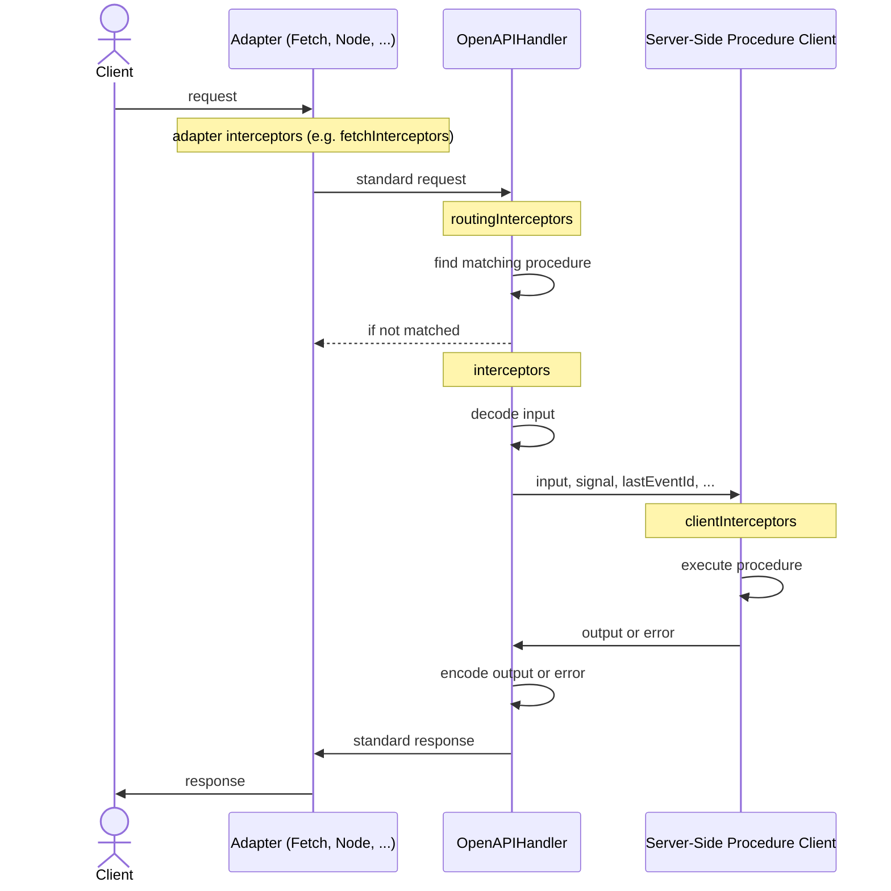

## Overview

```ts
const handler = new OpenAPIHandler(router, {
  interceptors: [
    async ({ next, path }) => {
      console.time(path.join('.'))

      try {
        return await next()
      }
      catch (err) {
        console.error(`${path.join('.')}:`, err)
        throw err
      }
      finally {
        console.timeEnd(path.join('.'))
      }
    }
  ],
  plugins: [
    new CORSHandlerPlugin()
  ],
})
```

:::info
The actual usage of `OpenAPIHandler` depends on the adapter you use. For example, when using the fetch adapter, the handler is used like this:

```ts
export async function fetch(request: Request) {
  const { matched, response } = await handler.handle(request, {
    prefix: '/api',
    context: {} // <- provide initial context if needed
  })

  if (matched) {
    return response
  }

  return new Response('Not Found', { status: 404 })
}
```

:::

:::warning
To better support `Blob`, `File`, and `ReadableStream<Uint8Array>` at the root level in cross-origin scenarios,
extend your [CORS allowlist](https://developer.mozilla.org/en-US/docs/Glossary/CORS-safelisted_response_header) to allow clients to send and receive the `Content-Disposition` and `Standard-Server` headers. Learn more in the [Standard Server documentation](https://github.com/middleapi/standard-server#how-body-parsing-works). If you use the [CORS Plugin](/docs/plugins/cors), include them in `allowHeaders` and `exposeHeaders`:

```ts
const cors = new CORSHandlerPlugin({
  allowHeaders: ['Content-Disposition', 'Standard-Server'],
  exposeHeaders: ['Content-Disposition', 'Standard-Server'],
})
```

:::

## Interceptors

Interceptors let you observe or change different stages of an OpenAPI request. Common use cases include logging, error handling, and metrics.

### Routing Interceptors

Routing interceptors run on every request before routing. Use them when you need to handle all requests, including requests that do not match a procedure.

```ts
const handler = new OpenAPIHandler(router, {
  routingInterceptors: [
    async ({ next, request, context }) => {
      if (condition) {
        return { matched: false }
      }

      const { matched, response } = await next()
      return { matched, response }
    },
  ],
})
```

### Interceptors

These interceptors run only for matched requests, after routing and before error handling (but can't use `ORPCError` for [typesafe errors](/docs/error-handling#orpcerror-compatibility)). Use them when you need access to the matched procedure.

:::tip
In most cases, `interceptors` are the best choice. They provide more context, are easier to work with, and run before error handling.
:::

```ts
const handler = new OpenAPIHandler(router, {
  interceptors: [
    async ({ next, request, procedure, context }) => {
      try {
        const response = await next()
        return response
      }
      catch (err) {
        if (err instanceof CustomError) {
          throw new ORPCError('CUSTOM_ERROR', { message: err.message, cause: err })
        }

        throw err
      }
    },
    async ({ next, path }) => {
      console.time(path.join('.'))

      try {
        const response = await next()
        return response
      }
      catch (err) {
        console.error(`${path.join('.')}:`, err)
        throw err
      }
      finally {
        console.timeEnd(path.join('.'))
      }
    },
  ],
})
```

### Client Interceptors

Client interceptors run only for matched requests, after input decoding, before output encoding and can use `ORPCError` for [typesafe errors](/docs/error-handling#orpcerror-compatibility). Use them when you need access to the procedure, input, and output.

```ts
const handler = new OpenAPIHandler(router, {
  clientInterceptors: [
    async ({ next, input, context, procedure }) => {
      const output = await next()
      return output
    },
  ],
})
```

### Adapter Interceptors

Some `OpenAPIHandler` implementations, such as fetch or node adapters, also support adapter interceptors. These run before [Routing Interceptors](#routing-interceptors) and let you work with the adapter's native request and response objects.

```ts
const handler = new OpenAPIHandler(router, {
  fetchInterceptors: [
    async ({ next, request }) => {
      const { matched, response } = await next()
      return { matched, response }
    },
  ],
})
```

:::info
This example uses the fetch adapter. For other adapters, refer to their JSDoc or adapter-specific documentation.
:::

## Plugins

Plugins package reusable interceptors. For example, [CORS Plugin](/docs/plugins/cors) adds a [routing interceptor](#routing-interceptors) to handle preflight requests and adds CORS headers to every response.

```ts
const handler = new OpenAPIHandler(router, {
  plugins: [
    new CORSHandlerPlugin()
  ],
})
```

## Custom Serializer

Provide a custom serializer when you need to extend or override the default serialization behavior. For more details, see [OpenAPI Serializer](/docs/openapi/serializer).

```ts
const handler = new OpenAPIHandler(router, {
  serializer: new OpenAPISerializer({
    handlers: {
      // ...custom handlers
    },
  }),
})
```

## Filtering Procedures

Use the `filter` option to exclude procedures from matching:

```ts
const handler = new OpenAPIHandler(router, {
  filter: (contract, path) => getIsInternalMeta(contract) !== true,
})
```

## Custom Error Response

By default, `OpenAPIHandler` determines response status codes using `COMMON_ERROR_STATUS_MAP` and encodes error bodies in the ORPC error format. Use `errorStatusMap` and `customErrorResponseBodyEncoder` to customize this behavior:

```ts
import { COMMON_ERROR_STATUS_MAP } from '@orpc/openapi'

const handler = new OpenAPIHandler(router, {
  /**
   * The status code should be in the `4xx` or `5xx` range (must be greater than or equal to `400`).
   */
  errorStatusMap: {
    ...COMMON_ERROR_STATUS_MAP,
    CUSTOM_ERROR: 599,
  },
  customErrorResponseBodyEncoder: (error) => {
    if (error.code === 'CUSTOM_ERROR') {
      return {
        customMessage: error.message,
        customCode: error.code,
      }
    }

    // fallback to default by returning null or undefined
    return null
  },
})
```

<Expandable title="Common Error Status Map">

| Error Code             | HTTP Status Code |
| ---------------------- | ---------------: |
| BAD_REQUEST            |              400 |
| UNAUTHORIZED           |              401 |
| PAYMENT_REQUIRED       |              402 |
| FORBIDDEN              |              403 |
| NOT_FOUND              |              404 |
| METHOD_NOT_SUPPORTED   |              405 |
| NOT_ACCEPTABLE         |              406 |
| TIMEOUT                |              408 |
| CONFLICT               |              409 |
| GONE                   |              410 |
| PRECONDITION_FAILED    |              412 |
| PAYLOAD_TOO_LARGE      |              413 |
| UNSUPPORTED_MEDIA_TYPE |              415 |
| UNPROCESSABLE_CONTENT  |              422 |
| PRECONDITION_REQUIRED  |              428 |
| TOO_MANY_REQUESTS      |              429 |
| CLIENT_CLOSED_REQUEST  |              499 |
| INTERNAL_SERVER_ERROR  |              500 |
| NOT_IMPLEMENTED        |              501 |
| BAD_GATEWAY            |              502 |
| SERVICE_UNAVAILABLE    |              503 |
| GATEWAY_TIMEOUT        |              504 |

</Expandable>

:::info
If you use `OpenAPILink` with a custom server-side error format, make sure to configure [Custom Error Decoding](/docs/openapi/link#custom-error-decoding).
:::

## Event Stream Options

Configure how an [AsyncIteratorObject](/docs/async-iterator-object) is streamed to the client. Available options depend on the adapter. For example, the fetch adapter supports:

```ts
const handler = new OpenAPIHandler(router, {
  toFetchResponse: {
    eventStream: {
      initialComment: {
        /**
         * If true, an initial comment is sent immediately upon stream start to flush headers.
         * This allows the receiving side to establish the connection without waiting for the first event.
         *
         * @default true
         */
        enabled: true,
        /**
         * The content of the initial comment sent upon stream start. Must not include newline characters.
         *
         * @default ''
         */
        comment: '',
      },
      keepAlive: {
        /**
         * If true, a ping comment is sent periodically to keep the connection alive.
         *
         * @default true
         */
        enabled: true,
        /**
         * Interval (in milliseconds) between ping comments sent after the last event.
         *
         * @default 15000
         */
        interval: 15000,
        /**
         * The content of the ping comment. Must not include newline characters.
         *
         * @default ''
         */
        comment: '',
      },
      /**
       * If true, a `close` event is sent even when the iterator completes with `undefined`.
       * When the iterator returns a value, a `close` event is always emitted regardless of this setting.
       *
       * @default true
       */
      emptyCloseEventEnabled: true,
    },
  },
})
```

## Lifecycle

The diagram below shows how a request flows through `OpenAPIHandler` and where each interceptor type runs:



:::info
The server-side procedure client follows the [Server-Side Client Lifecycle](/docs/client/server-side#lifecycle), and `clientInterceptors` behave like server-side client `interceptors`.
:::
